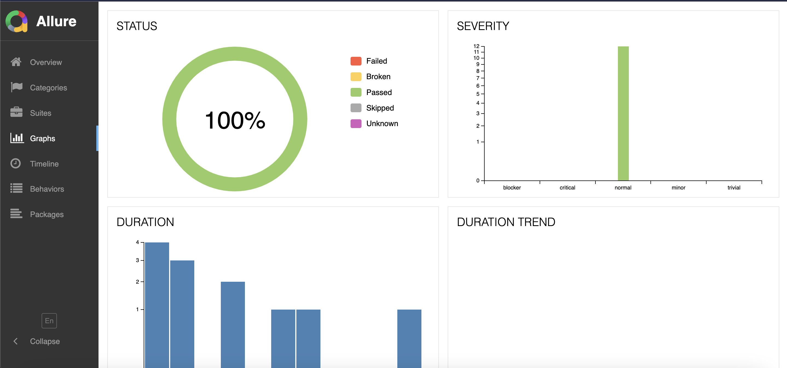

# sauce-demo-testing

## In order to run and use this project you must have nodeJS and npm installed:

https://nodejs.org/en/download/package-manager

Make sure you have those versions of nodeJS at least:

Node.js 18.x, 20.x, 22.x and above.

## Create .env file in the root directory

```
USERNAME=USERNAME_YOU_WANT
PASSWORD=PASSWORD_YOU_WANT
```

## How to run the automation

### First install all dependencies:

```
npm install
```

###  Run the automation:

Sequencial mode:

```
npm run e2e
```

Parallel mode:

```
npm run e2e:parallel
```

* obs: 1 scenario from login is expected to failed (Verifies user which contains problem on cart page). An issue was created on GitHub, you can see it from _[/issues/](https://github.com/Rogatto/sauce-demo-testing/issues/5)_


### Generate Allure Report:

Before running the following command to generate allure report, you must install allure command line:

```
npm i allure-commandline
```

```
npm run report:allure
```

